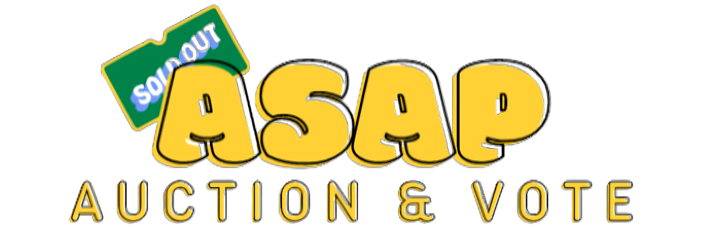
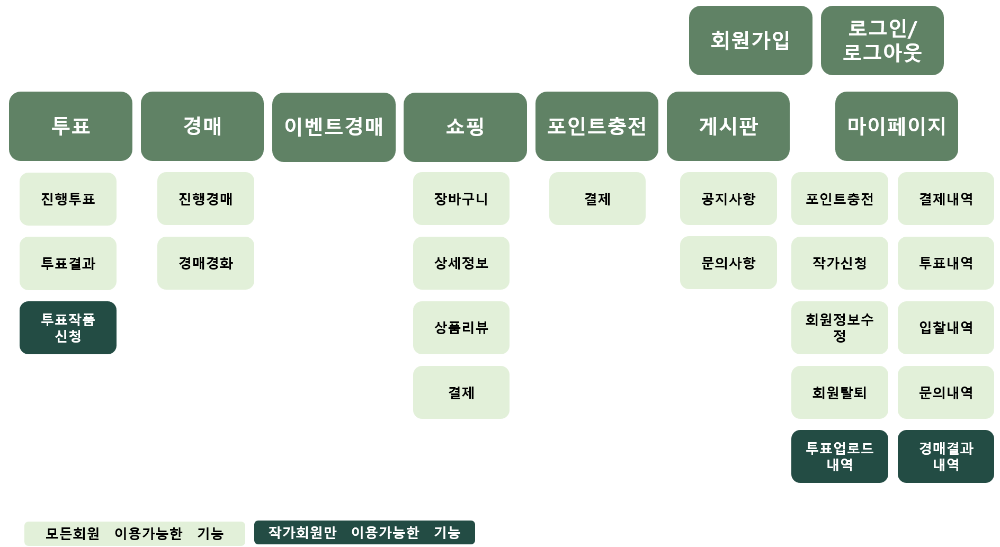
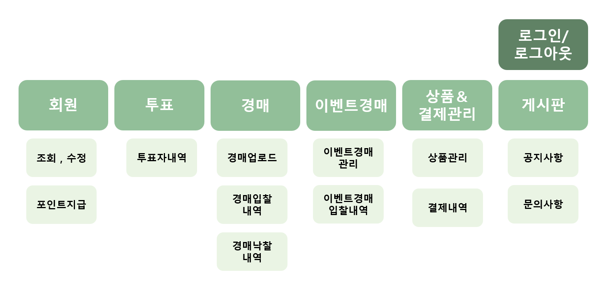
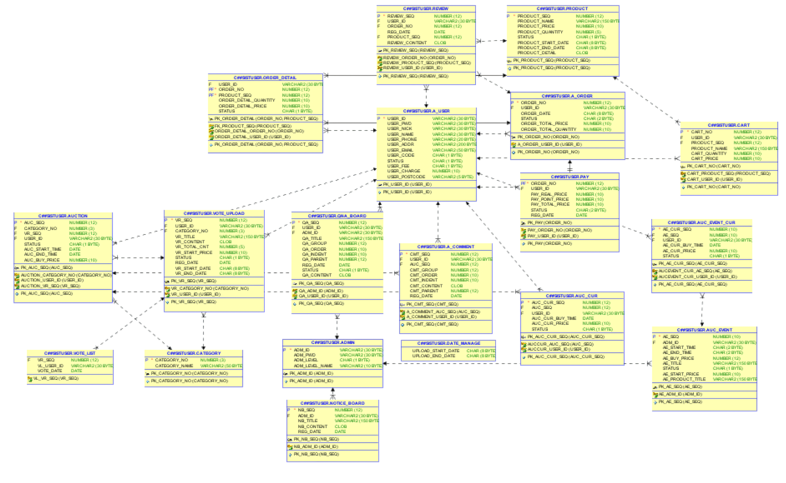
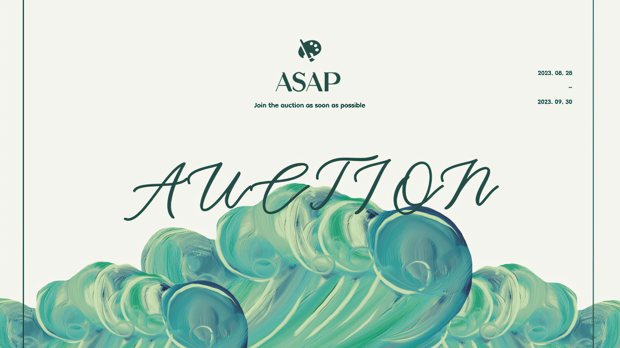
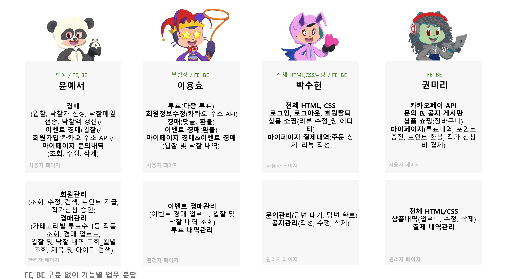

　　　　　　　　　　　

&nbsp;&nbsp;&nbsp;&nbsp;&nbsp;&nbsp;&nbsp;
</br>
</br>

## 📋 목차
1. [웹서비스 소개](https://github.com/sovus3/ASAP#-%EC%9B%B9%EC%84%9C%EB%B9%84%EC%8A%A4-%EC%86%8C%EA%B0%9C)
4. [개발기간](https://github.com/sovus3/ASAP#-%EA%B0%9C%EB%B0%9C-%EA%B8%B0%EA%B0%84)
5. [기술스택](https://github.com/sovus3/ASAP#-%EA%B8%B0%EC%88%A0-%EC%8A%A4%ED%83%9D)
6. [주요기능](https://github.com/sovus3/ASAP#%EF%B8%8F-%EC%A3%BC%EC%9A%94-%EA%B8%B0%EB%8A%A5)
7. [프로젝트구성도](https://github.com/sovus3/ASAP#%EF%B8%8F-%ED%94%84%EB%A1%9C%EC%A0%9D%ED%8A%B8-%EA%B5%AC%EC%84%B1%EB%8F%84)
8. [UCC영상](https://github.com/sovus3/ASAP#-ucc%EC%98%81%EC%83%81)
9. [팀소개](https://github.com/sovus3/ASAP#-%ED%8C%80-%EC%86%8C%EA%B0%9C)
10. [프로젝트 후기 및 아쉬운 점](https://github.com/sovus3/ASAP#-%ED%94%84%EB%A1%9C%EC%A0%9D%ED%8A%B8-%ED%9B%84%EA%B8%B0-%EB%B0%8F-%EC%95%84%EC%89%AC%EC%9A%B4-%EC%A0%90)
<br/>

## 🔊 웹서비스 소개
> **ASAP**은 'As Soon As Possible(가능한 한 최대한 빨리)'의 의미로<br/>
> 원하는 작품을 구매하기 위해서는 경매에 최대한 빨리 참여해야 한다는 의미입니다.

ASAP은 무명 작가들의 홍보 및 수익 파이프라인 확대를 위한 작품 경매 및 굿즈 판매 서비스를 제공하는 웹사이트입니다.<br/>
사용자들에게는 예술 작품을 보다 가깝게 경험할 수 있는 기회를,<br/>인지도가 낮은 작가들에게는 홍보의 기회를 제공하기 위해 투표 시스템을 도입하였습니다.  <br/>
**투표를 통해 선정된 1등 작품**은 **경매**에 참여하여 수익을 창출할 수 있도록 기획했습니다. <br/>
그리고 경매 작품을 기반으로 한 다양한 **파생 상품을 판매**하여 작가의 수익 파이프라인을 확대하고, <br/>낙찰받지 못한 사용자들에게는 작품을 접할 수 있는 기회를 제공합니다.<br/>
<br/>

## 📆 개발 기간
**2023.08.28 ~ 2023.09.30 (1개월)**

<br/>

## 💻 기술 스택
|FrontEnd|OS|Collaborations|
|:------:|:---:|:---:|
|&nbsp;&nbsp; |||

|BackEnd|Server|DB|
|:------:|:---:|:---:|
|&nbsp;|||

<br/>

## ✒️ 주요 기능
- **카테고리 별 조회, 월 별 조회 및 각종 검색 기능**<br/>
```
투표내역 및 결과를 미술,도예,사진의 카테고리 별로 조회가 가능하며, 경매 결과는 월 별로 조회가 가능하다.
관리자 페이지에서는 모든 내역을 제목, 아이디를 기본으로 필요한 검색 조건으로 검색할 수 있다.
```
- **다중 투표 기능**<br/>
```
여러 작품에 투표가 가능하지만, 한 작품에 여러번 투표는 불가능하다.
```
- **경매 입찰 기능**<br/>
```
포인트를 충전하여 경매에 참여할 수 있다.
처음 입찰을 하면 보유중인 포인트 내에서 입찰을 할 수 있고, 입찰 내역이 있다면 최신 입찰 금액으로 갱신된다.
```
- **경매 낙찰 성공 시 메일 알림, 실패 시 환불 기능**<br/>
```
가장 높은 금액을 입찰하여 낙찰을 받게 되면, 낙찰자를 선정한 후 낙찰 메일을 송신한다.
낙찰에 실패하게 되면 입찰을 넣은 포인트 금액은 환불된다.
```
- **카카오페이API를 통한 장바구니 결제 기능**<br/>
```
장바구니에 1개 이상의 상품을 담아 카카오 페이를 통해 일괄 결제가 가능하다.
```
- **게시판 CRUD기능**<br/>
```
공지 게시판과 문의 게시판에서 게시글 조회, 작성, 수정, 삭제가 가능하다.
```
- **관리자 페이지의 전 기능의 내역 조회 및 각종 업로드 기능**<br/>
```
전체적인 관리를 위해 회원 관리, 투표 관리, 경매 관리 등 전체 기능에 대한 내역 조회가 가능하다.
부가적으로 포인트 지급 및 작가 신청 승인, 투표 신청 승인 및 경매 작품 업로드 등과 같은 각족 업로드가 가능하다.
```

## 🗂️ 프로젝트 구성도
- **기능 조직도(사용자/관리자)**<br/>
<div>

<br/><br/>
</div>

- **시스템 아키텍처(System Architecture)**


- **ERD**<br/>


## 📷 UCC영상
[](https://youtu.be/uaQWlsQ-05g?t=0s)

## 👩‍👧‍👦 팀 소개


## ✅ 프로젝트 후기 및 아쉬운 점
**[교육 외의 필요한 사항을 학습]**
```
교육에서 Java언어를 중심으로 Spring MVC를 기반의 게시판(CRUD기능)을 만드는 것을 학습했습니다. 
이를 바탕으로 최종 프로젝트를 진행하였고, 교육에서 배운 것들을 적용 및 응용할 수 있는 좋은 경험이었습니다.
그리고 기능을 구현함에 있어 교육에서 배운 것들 외의 추가적인 것들이 필요했고,
API를 활용하거나 Spring의 다른 기능들을 활용하여 더욱 풍성하게 기능을 구성하도록 하였습니다.
```
**[협업에 있어서 소통의 중요성]**
```
각 팀원이 어디까지 업무를 진행했고 어떤 업무가 남아있는지 공유하는 작업을 매일 했습니다.
그리고 매주 주간 회의를 진행하여 전 주 업무 달성률을 확인하고, 회의 주간의 목표를 설정 및 공유했습니다.
```
**[한정된 시간으로 인해 선택적 기능 구현 및 오류 수정]**
```
아쉬운 점은 1개월이라는 한정된 기한으로 인해 구현하고자 했던 기능을 모두 구현하지 못한 점이 가장 아쉬운 점입니다.
시연을 위한 테스트를 진행하고 오류를 수정할 때, 시연 시 보여지는 기능들을 우선하여 수정한 점도 아쉬운 점입니다.
```
